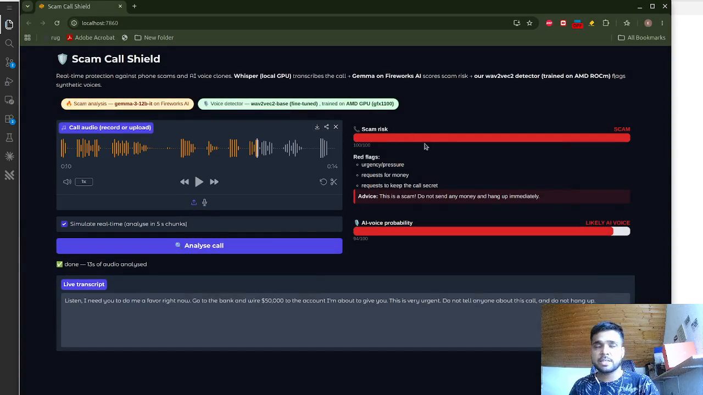

# 🛡️ Scam Call Shield

**Real-time phone-scam and AI-voice-clone detection.**
AMD Developer Hackathon (ACT II) — Track 3: Unicorn (Open Innovation).

## 🎬 Demo video

[](assets/demo_video_shield_scam.mp4)

*Click the image to watch the 4½-minute demo: a scam call is transcribed live,
Gemma flags the red flags in real time, and the AMD-trained detector calls out
the AI-cloned voice.*

Voice can no longer be trusted as identity: 3 seconds of audio is enough to clone
anyone's voice, and AI voice scams surged over 1,200% in 2025 (FBI: $3B+ in losses).
The human ear has lost this arms race — detection has to move to the device, onto
the live call. Scam Call Shield does exactly that, on two independent axes:

1. **What is being said** — local Whisper transcribes the call on-GPU; **Gemma 3 12B
   served by Fireworks AI** scores scam patterns in real time (urgency, bank
   impersonation, gift cards, code requests…) and gives the callee plain-language advice.
2. **Who is speaking** — a **wav2vec2 detector fine-tuned on an AMD GPU via ROCm**
   scores every 3-second window for synthetic-voice artefacts and shows a live
   human-vs-AI authenticity meter.

Off-the-shelf anti-spoofing checkpoints misclassified real microphone voices as
AI (domain shift: they were trained on studio audio and 2019-era TTS) — so this
project builds its own dataset (LibriSpeech + 26 modern neural TTS voices +
XTTS-v2 voice clones + the In-the-Wild deepfake corpus, with phone-call
augmentation) and trains its own detectors on it.

## AMD compute usage

The production detector is trained **and** evaluated on AMD hardware through ROCm
PyTorch. Machine-checkable evidence is committed in
[`voice_trends/`](voice_trends/) — the training script records the accelerator it
ran on into its log:

```json
"gpu":  "AMD GPU (gfx1100)",     // AMD Radeon PRO W7900, 51.5 GB
"rocm": true,
"hip":  "7.2.53211-e1a6bc5663",
"torch":"2.9.1+gitff65f5b"
```

Reproduce with [`train_on_amd.ipynb`](train_on_amd.ipynb). No code changes are
needed between vendors: ROCm PyTorch exposes AMD GPUs through the standard
`torch.cuda` API, so the same `train.py` / `finetune_w2v.py` run unmodified on
either stack.

The scam-analysis LLM is **Gemma 3 12B Instruct, deployed on Fireworks AI** (which
serves open models on AMD accelerators) — so both axes of the product sit on AMD
silicon. The app displays the active model and the GPU its detector was trained on
directly in the UI. `FIREWORKS_MODEL` in `.env` selects the deployment; the demo
falls back to a serverless model when the dedicated Gemma deployment is torn down.

## Detector evaluation: four tiers of honesty

Most deepfake-detector numbers are inflated by evaluation leakage. We evaluate at
four difficulty tiers, each **speaker- and voice-disjoint** from training:

- **Tier 1 — unseen voice, same engine**: 5 held-out edge-tts voices + 15% held-out
  LibriSpeech speakers.
- **Tier 2/3 — unseen engine + voice clone of a known speaker**: XTTS-v2 cloning
  held-out LibriSpeech speakers from their own reference audio; test clones are
  speaker-disjoint from training clones.
- **Tier 4 — real-world internet deepfakes**: the In-the-Wild dataset (Frank &
  Schönherr) — deepfakes of celebrities/politicians from the internet (many
  engines, incl. voice conversion) + genuine recordings of the same people,
  split by speaker 70/10/20.

All numbers below are from the model **trained and evaluated on the AMD GPU**
(`voice_trends/deepfake_eval.json`, `finetune_log.json`):

| wav2vec2-base fine-tuned (production) | Detection | False positives on real humans |
|---|---|---|
| Tier 1: unseen edge-tts voices (n=231) | 100% | 21.8% (LibriSpeech held-out speakers) |
| Tier 2/3: XTTS-v2 clones, unseen speakers (n=175) | 89.7% | — |
| Tier 4: In-the-Wild deepfakes, unseen speakers (n=3,393) | **98.6%** | **0.0%** (n=9,868 genuine recordings) |

The LibriSpeech false-positive rate (21.8%) is the weakest number and we publish it
rather than bury it: LibriSpeech is clean studio read speech, the least
call-like audio in the set. On realistic audio — the In-the-Wild genuine
recordings, which are noisy, compressed and phone-like — the same model raises
**no** false alarms.

Hard-sample spot checks (never in any training/val set):

| Clip | ai_prob | Verdict |
|---|---|---|
| Owner's real voice, held-out phone recording | 0.018 | ✅ human |
| XTTS-v2 clone of the owner, "send €500" | 0.974 | ✅ caught |
| XTTS-v2 clone of the owner, *benign* text | 0.974 | ✅ caught |
| Real Donald Trump speech (noisy, compressed) | 0.053 | ✅ human |
| XTTS-v2 Trump clone (made from the real clip above) | 0.935 | ✅ caught |
| edge-tts scam call | 0.972 | ✅ caught |

The story these numbers tell (found the hard way):

1. Trained only on edge-tts, both models scored ~100% on tier 1 but **13–23% on
   XTTS clones** — engine-disjoint generalization is the real problem.
2. Adding XTTS clones + In-the-Wild to training, with checkpoint selection on
   `mean(tier1, clone_val, itw_val, owner)`, fixed it — but only for the
   pretrained model. The from-scratch CNN baseline could only "solve" clones by
   flagging everything (46–58% human false positives); wav2vec2's 960 h of
   self-supervised pretraining is what learns actual synthesis artifacts.
3. **The model then flagged the author's own phone recording as AI (p=0.89).**
   Root cause: our human data (LibriSpeech, internet audio) contains no modern
   consumer-phone recordings, while our AI data is uniformly clean and
   mp3-encoded — so the model had quietly learned *"clean + compressed =
   synthetic"*. Two fixes: **codec augmentation** applied to both classes (so
   compression stops being a class cue), and **voice enrollment** — the owner's
   voice added to the human class, exactly as a shipping app would do at setup.
   Result: 0.89 → 0.02 on held-out clips of the owner, while clones of the
   owner still fire at 0.97.
4. **Honest cost:** removing the compression shortcut lost us a YouTube fake-Trump
   clip we had previously caught (0.79 → 0.002). That clip is likely *voice
   conversion* (real human prosody, swapped timbre) — a distinct attack family we
   have no training data for. We report the miss rather than hide it; RVC-style
   training data is the clear next iteration.

Full numbers: [`voice_trends/deepfake_eval.json`](voice_trends/deepfake_eval.json).
Reproduce: `make_xtts_clones.py` (isolated Coqui venv, see Quickstart) →
`train.py` / `finetune_w2v.py` → `eval_deepfake.py`. XTTS-v2 weights are
CPML-licensed (non-commercial) — used only for the evaluation/hardening set.
The app uses the wav2vec2 detector by default and falls back to the CNN if absent.

## Architecture

```
                 ┌─ faster-whisper (local GPU) ─→ transcript ─→ Fireworks AI LLM ─→ scam risk + red flags + advice
call audio ──────┤
 (5 s chunks)    └─ wav2vec2 detector (fine-tuned on AMD ROCm) ─→ AI-voice probability meter
                    scored over overlapping 3 s windows
```

## Quickstart

```bash
python3 -m venv .venv && source .venv/bin/activate
pip install -r requirements.txt        # on AMD: install ROCm torch wheels first (see requirements.txt)

cp .env.example .env                   # then paste your Fireworks API key

# 1. Build the dataset (LibriSpeech + edge-tts neural voices), ~20 min
python -m voice_classifier.prepare_data --max-human 1200 --max-ai 1200

# 2. Build the XTTS-v2 clone attack set (the engine-disjoint hardening data).
#    Coqui TTS needs its own venv (it pins transformers 4.x / torch 2.8):
python3 -m venv .venv-tts && .venv-tts/bin/pip install "coqui-tts[codec]" "transformers<5" "torch==2.8.*" "torchaudio==2.8.*" librosa soundfile tqdm
COQUI_TOS_AGREED=1 .venv-tts/bin/python -m voice_classifier.make_xtts_clones --n 350
COQUI_TOS_AGREED=1 .venv-tts/bin/python -m voice_classifier.make_xtts_clones --itw-refs --n 120

# 3. (optional) In-the-Wild corpus — real internet deepfakes, for tier-4 eval:
#    https://owncloud.fraunhofer.de/index.php/s/JZgXh0JEAF0elxa  -> data_raw/release_in_the_wild/

# 4. Enroll the device owner's voice — put your own recordings in hard_samples/
#    first. This is what stops the detector from flagging YOU as AI.
python -m voice_classifier.enroll

# 5. Train both detectors (minutes on a GPU); checkpoints land in voice_trends/
python -m voice_classifier.train --epochs 14          # CNN baseline
python -m voice_classifier.finetune_w2v --epochs 5    # wav2vec2 fine-tune (production)

# 6. Reproduce the four-tier evaluation table
python -m voice_classifier.eval_deepfake

# 7. Launch the demo
python app.py                          # http://localhost:7860
```

## Demo

- Record yourself (or upload a call recording) → green meters.
- Play a scam script or a TTS/voice-clone sample → scam meter and AI-voice meter go red
  mid-call, with red flags and advice for the callee.
- "Simulate real-time" analyses the recording in growing 5-second chunks, exactly as a
  live call monitor would.

## Deployment roadmap (the AMD story)

1. **Today**: deepfake detection fine-tuned and served on AMD GPUs (ROCm)
   in the cloud; Whisper runs locally on the user's device.
2. **Next**: quantize/distill the wav2vec2 detector so the full shield — ASR,
   scam analysis, voice authentication — runs on-device, and no call audio ever
   leaves the phone.

## Honest limitations

- These are real working points, not a solved problem: ~85% on unseen-speaker
  clones and ~99% on 2022-era internet deepfakes, at 7–10% false positives. The
  detector raises the cost of an attack; brand-new 2026 commercial engines will
  still land hits until they are added to training — which the pipeline makes a
  one-command job (`make_xtts_clones.py` pattern for any new engine → retrain →
  4-tier eval).
- Real telephone audio (8 kHz, codec-compressed) is approximated via augmentation;
  production deployment would fine-tune on genuine call recordings.
- In-the-Wild's deepfakes are ~2022-era; continuous retraining against current
  engines (F5-TTS, OpenVoice, commercial cloning APIs) is the roadmap.
- **Voice conversion (RVC-style) is not yet covered** — see the missed YouTube
  clip above. TTS and cloning synthesise speech from text; voice conversion keeps
  a real human's prosody and swaps only timbre, leaving far fewer artefacts.
  Training data for it is the top priority for the next iteration.
- Enrollment (the owner's voice in the human class) is what a shipping app does at
  setup. Reported numbers use held-out owner clips the model never trained on.

## Repo layout

```
app.py                     Gradio demo (transcript + scam meter + authenticity meter)
transcriber.py             faster-whisper wrapper (local GPU ASR)
scam_detector.py           Fireworks AI scam analysis (JSON verdict)
voice_classifier/
  model.py                 mel-spectrogram CNN + device selection (CUDA/ROCm)
  prepare_data.py          LibriSpeech + edge-tts dataset builder
  splits.py                voice-disjoint split + 3-way XTTS clone split + enrollment
  enroll.py                voice enrollment: owner's voice -> held-out train/test clips
  train.py                 CNN baseline training loop (device-agnostic)
  finetune_w2v.py          wav2vec2-base fine-tuning (production detector)
  make_xtts_clones.py      XTTS-v2 voice-clone attack set (runs in .venv-tts)
  eval_deepfake.py         four-tier evaluation (edge-tts / clones / In-the-Wild / humans)
  pack_itw_subset.py       compact In-the-Wild bundle for uploading to a cloud GPU
  infer.py                 sliding-window scoring; prefers wav2vec2, falls back to CNN
train_on_amd.ipynb         the AMD ROCm training notebook (trains + evaluates both detectors)
voice_trends/              trained checkpoints, training logs (incl. AMD run), eval results
hard_samples/              hard test clips never used in training (real + fake public figures)
```

Note: the owner's own voice recordings and the scam-script clones of that voice are
deliberately **not** committed — publishing voice biometrics would hand an attacker
the exact material needed to clone the owner. Enrollment data is user-supplied; see
`enroll.py`.
